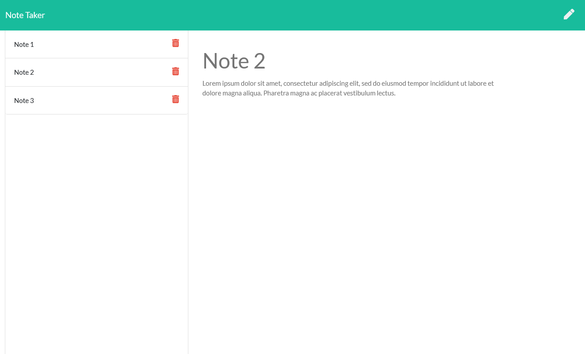

## 
  # Note-Taker
  ## Create an application called Note Taker that can be used to write and save notes. This application will use an Express.js back end and will save and retrieve note data from a JSON file.

  ------------------
  ## TECHNOLOGIES USED
  ### Node.js
  ### JavaScript
  ### Bootstrap
  ### Html
  ### CSS
  ### Heroku
  ------------------

  ------------------
  ## INSTALLATION
  ### You must install the following for this app to function:
  ### Dependencies: 
  ### express
  ### Heroku
  ------------------
  ## LICENSE  
  ### https://opensource.org/licenses/MIT
  ------------------
  ## DEPLOYMENT  
  ### https://christiandc19.github.io/note-taker/
  ### https://github.com/christiandc19/note-taker/
  ### Heroku App Link: https://nameless-falls-11259.herokuapp.com/
  ------------------
  ## QUESTIONS  
  ### If you have any questions, you may contact me at:
  ### Github: https://github.com/christiandc19 or,
  ### christiandc19@hotmail.com
